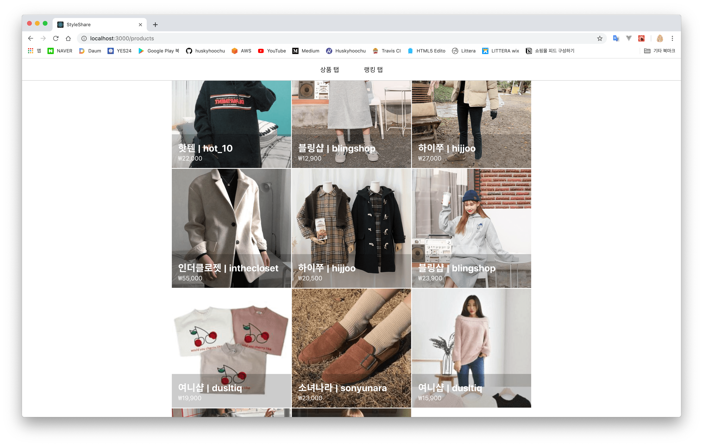
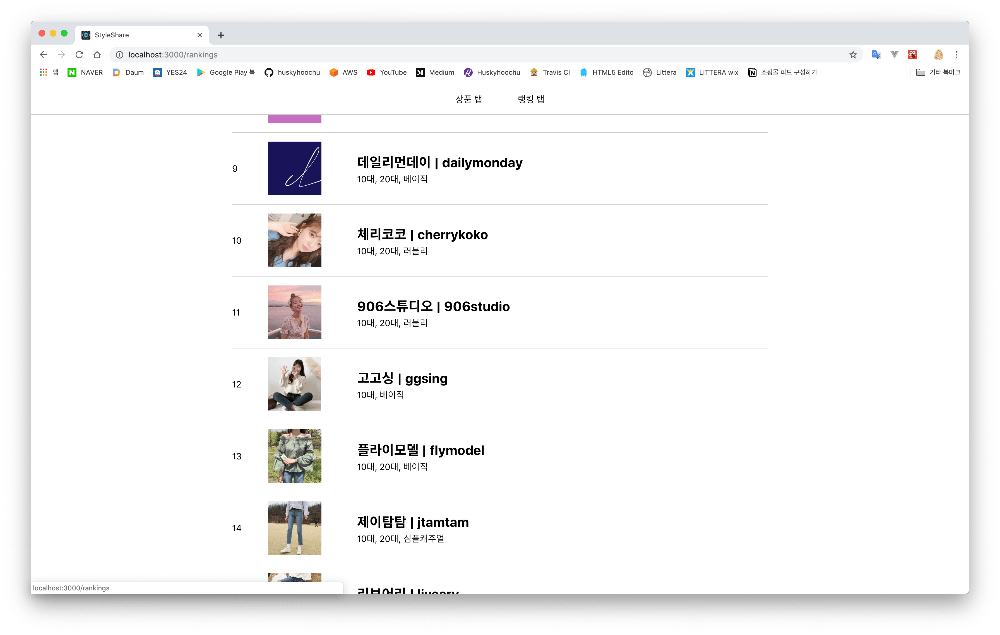

# 스타일쉐어 테스트 어플리케이션: 프론트엔드

> 쇼핑몰과 상품을 보여주는 웹 페이지

### 스크린샷





### 사용법

저장소를 다운받은 뒤 저장소 디렉터리로 들어와 의존성 패키지를 설치합니다.

```
$ cd frontend
$ yarn install
```

설치가 끝나면 개발 서버를 실행합니다.

```
$ yarn start
```

그러면 `http://localhost:3000` 주소로 웹 브라우저에서 페이지가 실행됩니다.

### 기술 스택

- Create-React-App
- TypeScript
- Redux & Redux Saga
